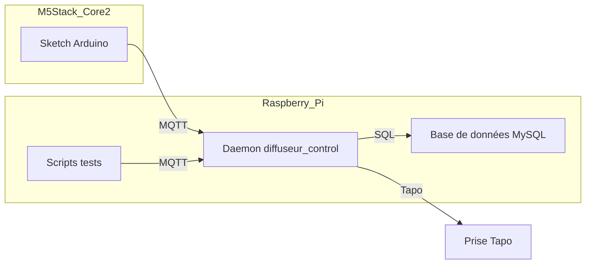

# ARCHITECTURE du dossier Indication_olfactive

Ce document décrit l’organisation et l’architecture de votre dépôt **Indication\_olfactive**, partie Affichage du projet Horloge.

---

## 1. Vue d'ensemble

Le dépôt se compose de trois blocs principaux :

1. **Libraries et exemples Arduino**

   * `lib/lib_arduino/M5Core2/examples/Unit/…` : exemples unitaires fournis par la lib M5Core2.

2. **Firmware et tests M5Stack Core2**

   * `src/M5Stack_Core2/` : dossier principal contenant votre sketch Arduino (`.ino`) et ses sources `.cpp/.h`, ainsi que des tests (M5Stack\_Core2\_Presence\_Test, M5Stack\_Core2\_Wifi\_Test) si maintenus.
   * `Archives/` : ancien code, versions précédentes et tests obsolètes.

3. **Services et scripts Raspberry Pi**

   * `src/Raspberry/` : contient :

     * `diffuseur_control.cpp` et ses headers (`config.cpp`, `config.h`) pour le daemon C++ (Systemd).
     * `lancer_diffuseur.sh` pour lancement manuel.
     * `logs/` : `diffuseur.log`, `diffuseur_error.log`.
     * `tmp/` : tests temporaires ou prototypes (bientôt à archiver ou supprimer).

4. **Dossier temporaire racine**

   * `tmp/` à la racine du dépôt : zone de travail pour tests et anciens sketches M5Stack Core2 – **ne contient pas** le code de production.

---

## 2. Organisation des dossiers

```text
Indication_olfactive/                    # Racine du dépôt
├─ lib/                                   # Bibliothèques Arduino tierces
│   └─ lib_arduino/M5Core2/examples/Unit/ # Exemples unitaires de la lib M5Core2
│       ├─ PubSubClient/
│       └─ ...  

├─ src/                                  # Code source de production
│   ├─ M5Stack_Core2/                    # Sketch Arduino principal et tests officiels
│   │   ├─ M5Stack_Core2.ino
│   │   ├─ config.h, utils.h/.cpp        # Config et utilitaires
│   │   └─ tests/                        # Tests organisés (scripts non compilés)
│   └─ Raspberry/                         # Service et scripts Pi
│       ├─ diffuseur_control.cpp         # Daemon C++ (Systemd)
│       ├─ config.cpp, config.h          # Configuration MQTT, MySQL, Tapo
│       ├─ lancer_diffuseur.sh           # Script de lancement
│       ├─ logs/                         # Logs du service
│       │   ├─ diffuseur.log
│       │   └─ diffuseur_error.log
│       └─ tmp/                          # Tests temporaires et prototypes

├─ Archives/                             # Ancien code et versions obsolètes
│   └─ ...

├─ tmp/                                  # Zone temporaire de tests (non production)

└─ docs/                                 # Documentation
    ├─ ARCHITECTURE.md
    └─ ...
```

---

## 3. Flux de communication



---

## 4. Principes et bonnes pratiques

* **Séparation claire** : production (`src/`) vs archives (`Archives/`) vs expérimentations (`tmp/`).
* **Configuration centralisée** : `config.h` (Arduino).
* **Évolution maîtrisée** : déplacer les prototypes de `src/.../tmp/` vers `Archives/` dès validation ou suppression.

© Projet Horloge • Partie Affichage - Architecture du dépôt Indication\_olfactive
